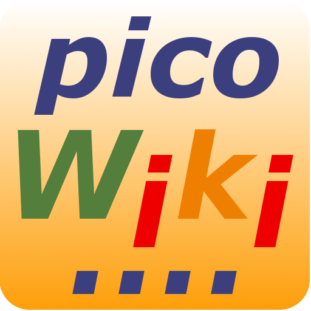

##  Pico Template App Qt6

### Description

This project provides a template for a simple Qt/Quick/QML application for Qt6. It can be used as starting point to create cross platform applications 
with the Qt framework. 

### Features

* Simple Template Qt/Quick/QML App
* Multi-Platform Builds: Windows, Linux, MacOS, Webassembly (WASM)
* Multi Page App
* Toolbar with default icons
* Menu
* Default about dialog
* Default settings dialog
* Translations
* App Icon
* Anroid:
  * Share (send & receive)
  * Android Storage Framework
  * possibility for debugging output into text file on SD card
* WASM:
  * File IO

### Workflow

Clone this repository and replace the app name "pico" or "picoapp" in all source and config files.

Build status: 

